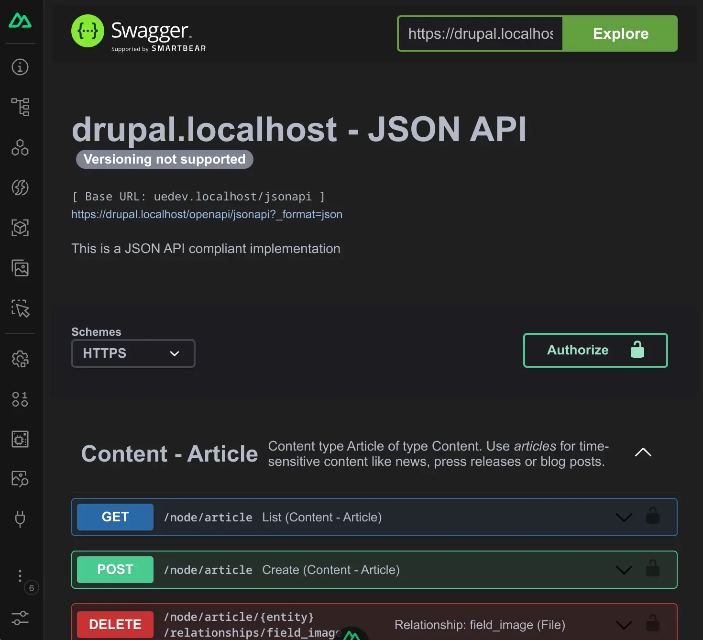

# Nuxt OpenApi

[![npm version][npm-version-src]][npm-version-href]
[![npm downloads][npm-downloads-src]][npm-downloads-href]
[![License][license-src]][license-href]
[![Nuxt][nuxt-src]][nuxt-href]

This module adds a Tab to nuxt devtools. It shows your OpenApi spec.



- [✨ &nbsp;Release Notes](/CHANGELOG.md)
<!-- - [🏀 Online playground](https://stackblitz.com/github/your-org/@woldtwerk/nuxt-openapi?file=playground%2Fapp.vue) -->
<!-- - [📖 &nbsp;Documentation](https://example.com) -->

## Features

<!-- Highlight some of the features your module provide here -->
- ⛰ &nbsp;SwaggerUI or Redoc
- 🚠 &nbsp;Autoconfig for nuxt-drupal

## Quick Setup

1. Add `@woldtwerk/nuxt-openapi` dependency to your project

```bash
# Using pnpm
pnpm add -D @woldtwerk/nuxt-openapi

# Using yarn
yarn add --dev @woldtwerk/nuxt-openapi

# Using npm
npm install --save-dev @woldtwerk/nuxt-openapi
```

2. Add `@woldtwerk/nuxt-openapi` to the `modules` section of `nuxt.config.ts`

```js
export default defineNuxtConfig({
  modules: [
    '@woldtwerk/nuxt-openapi'
  ]
})
```

3. Add your openapi url.
```js
export default defineNuxtConfig({
  openapi: {
    url: 'https://myapi'
  },
})
```

That's it! You can now use Nuxt OpenApi in your Nuxt app ✨

## Drupal
If you use @woldtwerk/nuxt-drupal no configuration is needed.
In your drupal you need to install [openapi](https://www.drupal.org/project/openapi) and [openapi_ui](https://www.drupal.org/project/openapi_ui).

## Development

```bash
# Install dependencies
pnpm install

# Generate type stubs
pnpm run dev:prepare

# Develop with the playground
pnpm run dev

# Build the playground
pnpm run dev:build

# Run ESLint
pnpm run lint

# Run Vitest
pnpm run test
pnpm run test:watch

# Release new version
pnpm run release
```

<!-- Badges -->
[npm-version-src]: https://img.shields.io/npm/v/@woldtwerk/nuxt-openapi/latest.svg?style=flat&colorA=18181B&colorB=28CF8D
[npm-version-href]: https://npmjs.com/package/@woldtwerk/nuxt-openapi

[npm-downloads-src]: https://img.shields.io/npm/dm/@woldtwerk/nuxt-openapi.svg?style=flat&colorA=18181B&colorB=28CF8D
[npm-downloads-href]: https://npmjs.com/package/@woldtwerk/nuxt-openapi

[license-src]: https://img.shields.io/npm/l/@woldtwerk/nuxt-openapi.svg?style=flat&colorA=18181B&colorB=28CF8D
[license-href]: https://npmjs.com/package/@woldtwerk/nuxt-openapi

[nuxt-src]: https://img.shields.io/badge/Nuxt-18181B?logo=nuxt.js
[nuxt-href]: https://nuxt.com
